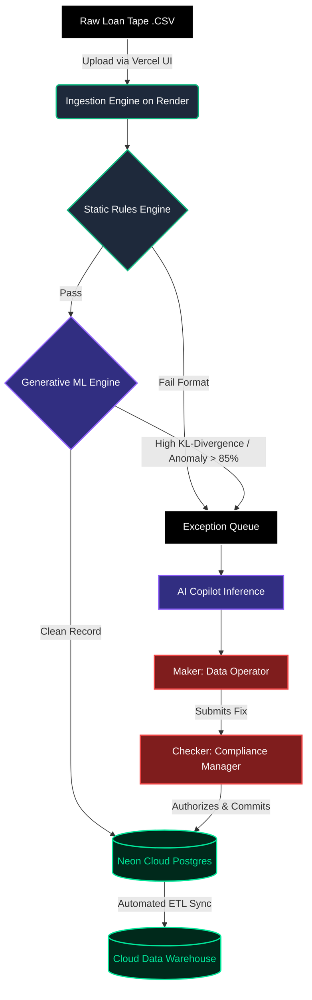

<div align="center">

# 🛡️ TrustTape Copilot
**Enterprise Data Validation, Maker-Checker Authorization, & Fraud Intelligence Engine**

[](https://your-app.vercel.app)
[](#)
[](#)
[](#)
[](#)

### 🚀 **[Launch Live Demo](https://your-app.vercel.app)** 🚀

</div>

## 📌 Product Overview

In institutional finance, onboarding raw loan tapes is a manual, error-prone, and highly risky bottleneck. **TrustTape Copilot** is a full-stack, AI-powered data ingestion platform built to automate tape processing, catch invisible financial anomalies, and enforce strict compliance workflows.

By combining deterministic rules with a simulated **Generative Machine Learning (VAE) pipeline**, TrustTape doesn't just check for blank fields—it actively detects multi-variable fraud. Coupled with an LLM-powered resolution Copilot and an enterprise-grade Maker-Checker authorization lock, this platform reduces tape processing time from days to minutes while mathematically guaranteeing data integrity.

---

## 🏗️ System Architecture



---

## ✨ Core Product Features

- **Intelligent Data Ingestion**: Lightning-fast CSV parsing that sanitizes, normalizes, and queues thousands of institutional loan records asynchronously.

- **Predictive Fraud Detection (VAE Simulation)**: Cross-references data points in a continuous latent space. If a borrower has an 'A' credit grade but a predatory 18.5% interest rate, the generative engine spikes the reconstruction loss and instantly flags the multi-variable anomaly.

- **AI Copilot Auto-Remediation**: Evaluates broken raw data against system constraints and generates one-click JSON payloads to fix errors, complete with confidence scoring.

- **Maker-Checker Authorization**: Strict Role-Based Access Control (RBAC). Data Operators (Makers) can only propose fixes; Compliance Managers (Checkers) must authorize them. Locked states prevent bypassing compliance.

- **Bulk Auto-Resolve Pipeline**: Enterprise-scale batch processing that allows AI to analyze and queue 500+ records simultaneously for single-click manager approval.

- **Cloud ETL Warehousing**: Once records reach 100% compliance, an automated Extract-Transform-Load (ETL) pipeline sweeps the operational database clean and archives the finalized tape into cold-storage analytics tables.

---

## 💻 Tech Stack & Cloud Infrastructure

| Layer | Technology |
|---|---|
| **Frontend Hosting** | Vercel (React 18, Vite, Tailwind CSS) |
| **Backend Hosting** | Render (Node.js, Express.js, TypeScript) |
| **Cloud Database** | Neon Serverless Postgres (Prisma ORM) |
| **AI Provider** | Google Gemini API |

---

## 🎯 Live Demo Presentation Flow

To demonstrate the full power of the platform to hackathon judges, execute this specific flow on the live deployment:

1. **Upload**: Navigate to **Data Ingestion** and upload a CSV containing one normal record and one hidden financial anomaly (e.g., mismatched interest rate to credit grade).

2. **Trigger ML**: Show how the *Generative ML Engine* caught the statistical anomaly and generated a `CRITICAL` alert, rather than just checking for missing text.

3. **Generate Fix**: Open the **Review Queue**, select the anomaly, and click **Ask AI Copilot**.

4. **Demonstrate RBAC**: Click *Submit Fix* as the **Data Operator** to lock the record. Toggle to **Compliance Manager** to authorize and commit the change to the database.

5. **Run ETL Sync**: Open the **Executive Report** and run the **Cloud Analytics Warehouse** pipeline to securely migrate the now-perfect tape into cold storage.

---

## 🚀 Local Setup (For Development)

If you wish to run this repository locally instead of using the live deployment:

### 1. Clone & Install

```bash
git clone https://github.com/your-username/trust-tape-copilot.git
cd trust-tape-copilot
cd frontend && npm install
cd ../backend && npm install
```

### 2. Environment Setup

Create a `.env` file in the `backend` directory:

```env
DATABASE_URL="your_neon_or_local_postgres_url"
GEMINI_API_KEY="your_google_ai_key"
```

### 3. Database Initialization & Run

```bash
cd backend
npx prisma db push
npx prisma db seed
npm run dev # Starts Backend on Port 3000

# Open a new terminal
cd frontend
npm run dev # Starts Frontend on Port 5173
```